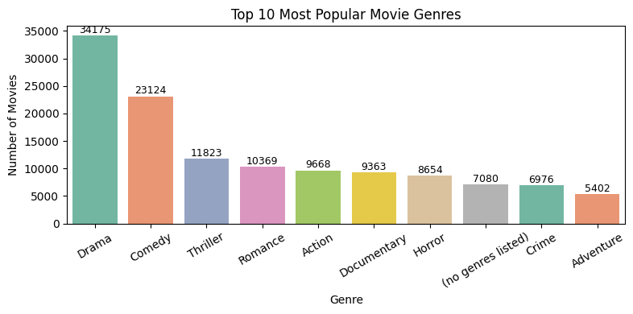
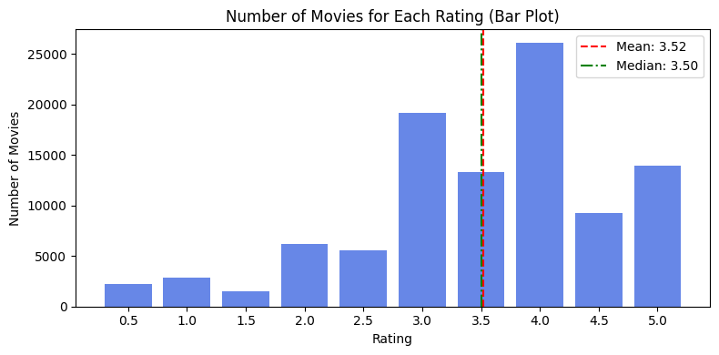
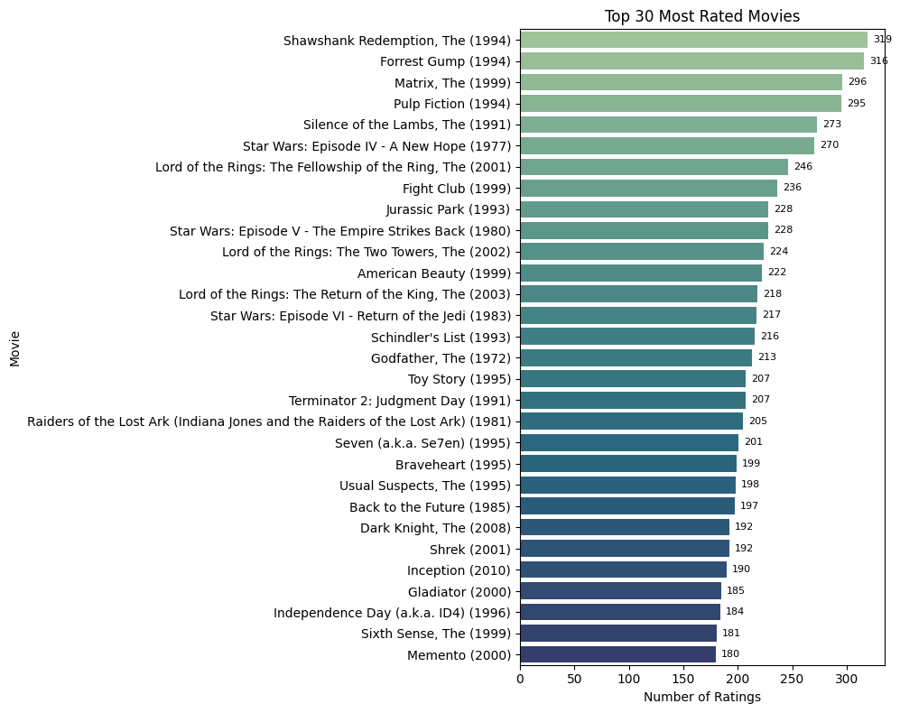
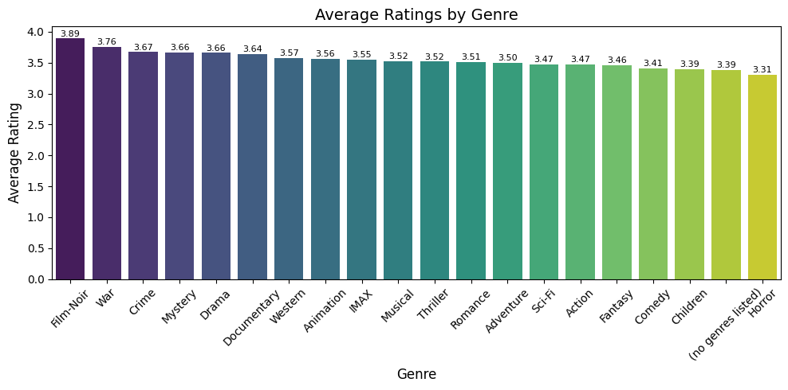
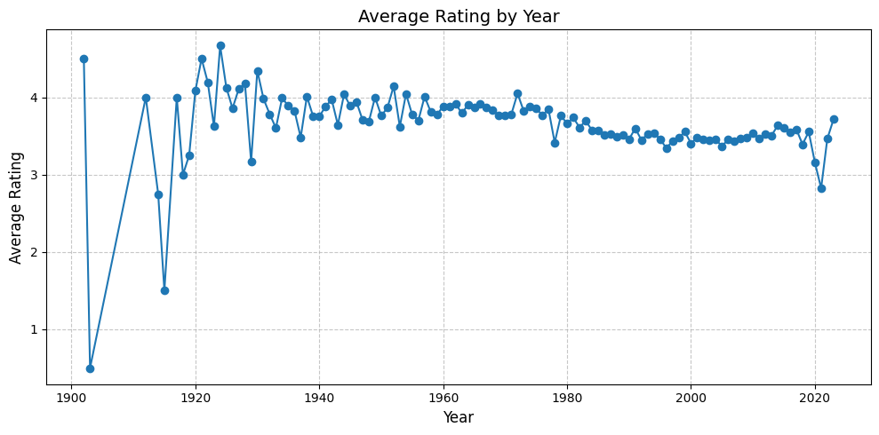
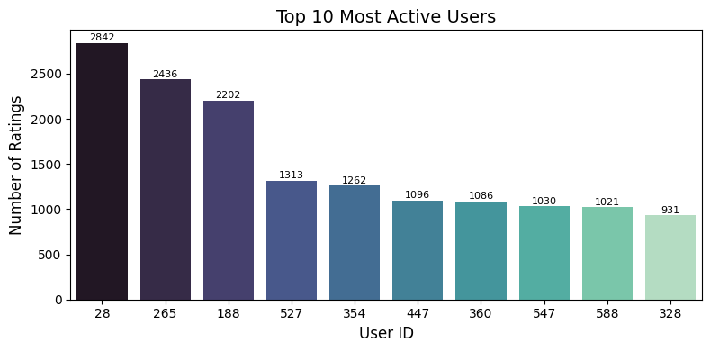
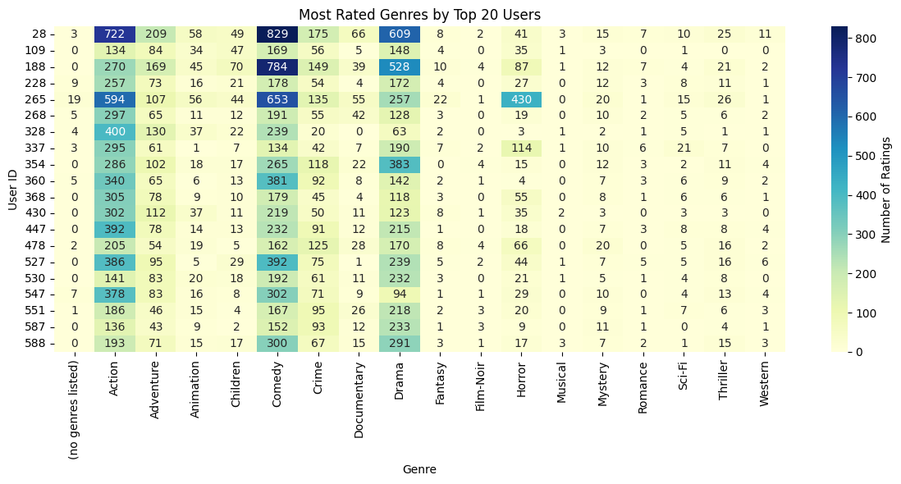

# Movie Data Analysis Project

This project analyzes and visualizes the MovieLens dataset using Python. It demonstrates data cleaning, exploratory data analysis, and visualization techniques. The project is structured for clarity and reproducibility, making it suitable for showcasing on GitHub.

## Project Structure
- `src/` : Source code and notebooks
- `data/` : Raw data files (not included in the repository)
- `requirements.txt` : Python dependencies
- `.gitignore` : Files and folders to ignore in git

## Data Files
**Note:** The CSV data files are not included in this repository due to their size. To run the analysis, download the following files and place them in the `data/` folder:

- `movies.csv`
- `links.csv`
- `ratings.csv`
- `tags.csv`

You can download the MovieLens dataset from [https://grouplens.org/datasets/movielens/32m/](https://grouplens.org/datasets/movielens/32m/)

## How to Run
1. Install dependencies: `pip install -r requirements.txt`
2. Start Jupyter Notebook: `jupyter notebook src/`
3. Open and run the notebook for analysis and visualizations

## Example Visualizations

- Most popular movie genres
- Distribution of ratings
- Top rated movies

Add your generated plots here for better project presentation. Example:

> Plots are saved only once for documentation. If you want to save new images, add `plt.savefig('images/your_plot_name.png')` to the relevant cell and run it manually.

## License
MIT
